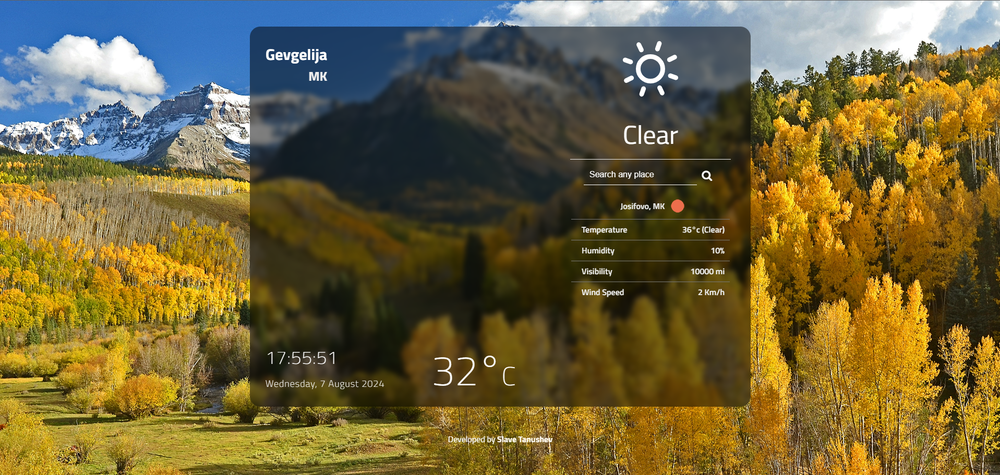

## A Simple Weather App

 

Check the weather around you and all over the world at a glance. Rely on the accurate weather forecast and adjust your schedule to the weather coming in. You won’t even have to look out the window as the app will make you feel like you are already outside!

Weather is sometimes difficult to predict. This accurate weather app allows to find out a detailed forecast wherever you are.

### *Features*:

* User-friendly
* Displays current Date and Time
* Responsive, on all devices

# *References*

* For Fonts: [Google Fonts](https://fonts.googleapis.com/css2?family=Work+Sans:wght@300&display=swap)
* For Basic Icons (like Trash and Check buttons): [font-awesome](https://fontawesome.com)
* For Favicon: [icons8](https://icons8.com/icons/)
* For JavaScript (Tutorial): [The Net Ninja](https://www.youtube.com/playlist?list=PL4cUxeGkcC9i9Ae2D9Ee1RvylH38dKuET)
* For help with CSS: [CSS Tricks](https://css-tricks.com/)
* For more CSS effects: [text-effects](https://speckyboy.com/underline-text-effects-css/)

# *Contributions*

- All contributors are most welcome! This is definitely open source!
